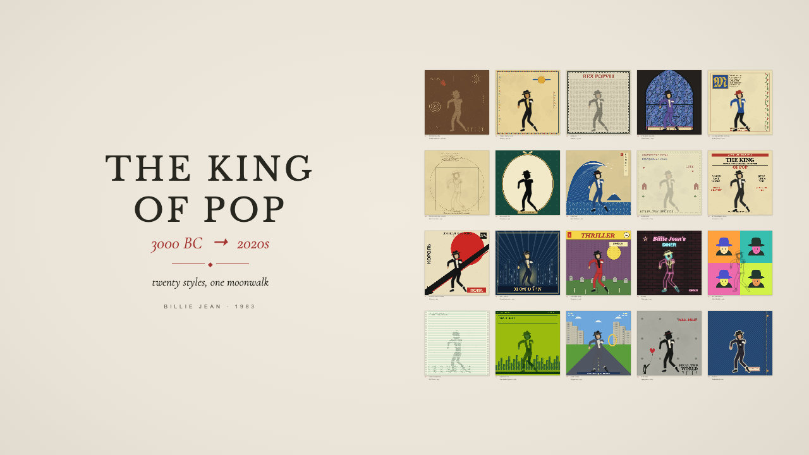

# The King of Pop

### Twenty styles, one moonwalk

An animated gallery tracing one moonwalk through twenty art styles, from ancient petroglyphs to embroidered patches. The gallery draws its posters and dancer locally using SVG and Canvas 2D. It does not play the reference video or use its frames as backgrounds.

[Open the gallery](https://hostlife22.github.io/moonwalk-art-gallery/) · [View the source](https://github.com/Hostlife22/moonwalk-art-gallery)



## Run

Node.js 22.12 or newer, npm:

```sh
npm ci
npm run dev
```

Open the local `/moonwalk-art-gallery/` URL printed by Vite. No API, account, CDN, or network request is needed during viewing. Fonts are bundled locally.

## Controls

- **Play / Pause**, **Replay**, **Overview**, **Sound** and the time slider.
- Select a poster or open **Explore the twenty works** for the keyboard-accessible catalogue.
- **Space** toggles playback when focus is outside a control. Arrow keys operate the time slider.
- **Hide** or **H** hides the interface. **H** or **Escape** restores it.
- Reduced-motion users start with a paused, complete gallery.
- Hidden browser tabs suspend playback. Resuming does not skip scenes.

For reproducible comparison, use `?time=31.7&seed=1983&controls=0`. The time is in seconds; this is a public presentation feature, not an injected test API. The sequence lasts 52.017 seconds and fades to paper. Replay starts a new showing. The provided video's original AAC soundtrack is included locally. Sound starts after Play, Replay, Space, or enabling Sound, and follows the shared clock through pause, seek and hidden tabs. A deliberate mute remains in effect on replay. The initial automatic visual introduction is silent until a user gesture.

## The twenty works

| #   | Work                | Material / era                |
| --- | ------------------- | ----------------------------- |
| 01  | PETROGLYPH          | Pecked sandstone, c. 3000 BC  |
| 02  | TOMB PAINTING       | Thebes, c. 1300 BC            |
| 03  | MOSAIC              | Pompeii, c. 79 AD             |
| 04  | STAINED GLASS       | Gothic lancet, c. 1250        |
| 05  | ILLUMINATED INITIAL | Book of hours, c. 1400        |
| 06  | PROPORTION STUDY    | After Leonardo, c. 1490       |
| 07  | SILHOUETTE          | Cut paper, c. 1790            |
| 08  | UKIYO-E             | After Hokusai, c. 1831        |
| 09  | SAMPLER             | Cross-stitch, c. 1843         |
| 10  | STRONGMAN BILL      | Letterpress, c. 1890          |
| 11  | CONSTRUCTIVISM      | Moscow, c. 1925               |
| 12  | ART DECO            | Streamline poster, c. 1935    |
| 13  | GOLDEN AGE          | Newsprint, c. 1938            |
| 14  | NEON                | Diner sign, c. 1955           |
| 15  | SILKSCREEN          | After Warhol, c. 1964         |
| 16  | LINE PRINTER        | ASCII art, c. 1975            |
| 17  | HANDHELD            | Four shades of green, c. 1989 |
| 18  | LOW POLY            | Polygon era, c. 1997          |
| 19  | STENCIL             | Spray paint, c. 2005          |
| 20  | PATCH               | Embroidered, 2020s            |

## Development

| Command                | Purpose                                    |
| ---------------------- | ------------------------------------------ |
| `npm run dev`          | Vite development server                    |
| `npm run build`        | TypeScript and production build            |
| `npm run preview`      | Serve the production build                 |
| `npm run format`       | Format source and documentation            |
| `npm run format:check` | Check formatting                           |
| `npm run lint`         | ESLint                                     |
| `npm run typecheck`    | Strict TypeScript                          |
| `npm test`             | Vitest model tests                         |
| `npm run test:e2e`     | Explicitly run Playwright browser checks   |
| `npm run check`        | Formatting, lint, types, unit tests, build |

Install Chromium with `npx playwright install chromium` before running browser checks. E2E is excluded from `check` and from deployment. The separate **Manual browser review** workflow runs only via `workflow_dispatch`.

The **Check and publish** workflow verifies `master` and PRs; successful checks on `master` publish `dist` to GitHub Pages. The Vite base matches the actual repository name.

## Implementation and review

One clock drives the gallery, masks and shared articulated dancer. Artwork metadata, choreography, layout, background SVG generators and figure renderers are separate modules. Static posters are cached; only visible large works are rendered. LOW POLY uses two-dimensional polygon shading and needs no WebGL.

- [Architecture](docs/ARCHITECTURE.md)
- [Validation evidence](docs/VALIDATION.md)
- [Visual differences and approximations](docs/VISUAL_REVIEW.md)
- [Accessibility](ACCESSIBILITY.md)
- [Contributing](CONTRIBUTING.md)

The implementation is a procedural interpretation with known visual differences, not a frame-exact reproduction. The review documents those differences explicitly.

## Licenses

Project code: MIT, © 2026 hostlife22. Cormorant Garamond and Libre Baskerville: SIL Open Font License; full notices are in `public/licenses/`. Those are chosen substitutes, not identified reference fonts. The project license does not grant rights to the reference video, soundtrack, Michael Jackson's identity, or third-party artwork.
