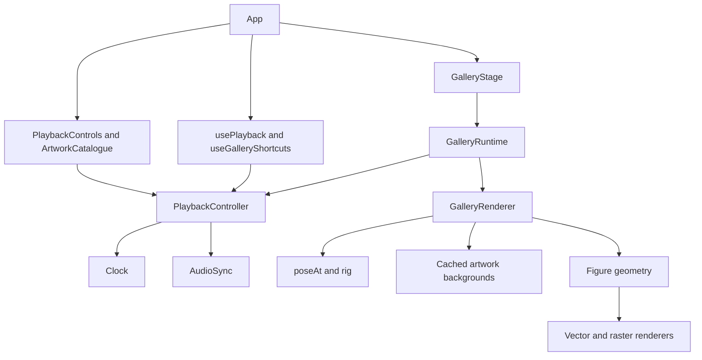

# Architecture

## Responsibilities



`App.tsx` composes the page. It owns presentation preferences such as hidden controls and reads URL/reduced-motion options once. It does not implement an animation loop, audio state transitions, or canvas drawing.

### Playback

- `playback/PlaybackController.ts` is the shared command layer for buttons, keyboard and artwork selection. It owns `Clock`, the audio connection, and the sound preference. It has no React or DOM dependency.
- `animation/clock.ts` handles time, pause, seek, hidden tabs and duration clamping. Long frames advance at most 100 ms.
- `animation/audio.ts` synchronizes the original local AAC stream to the visual clock. It handles drift, rejected playback and disposal.
- `hooks/usePlayback.ts` connects the controller to the media element and trusted browser gestures. React subscribes with `useSyncExternalStore`; unchanged snapshots keep their identity. Clock notifications are throttled to 80 ms; user commands notify immediately.
- `hooks/useGalleryShortcuts.ts` dispatches the same controller commands as the buttons. There is no separate keyboard implementation of play/pause.

Sound has four explicit states: `on`, `off`, `blocked`, `error`. A blocked autoplay attempt keeps the user's preference enabled and the control says **Sound start**. One press retries; the media's `playing` event changes the control to **Sound on**. A deliberate mute survives replay and audio reconnection. Playback failures leave the visual gallery usable.

The controller's audio connection returns a cleanup function. Disposed media promises cannot change the current state. Browser event handlers are registered and removed by their owning React hook.

### Canvas lifecycle

`components/GalleryStage.tsx` owns the canvas, stage and title elements and displays loading/error states. It creates one `gallery/GalleryRuntime.ts` instance per mount.

The runtime owns the single requestAnimationFrame, ResizeObserver, visibility listener and background loading. Each frame advances the controller, reads the timeline and draws only when the time or dimensions change. The runtime also converts canvas clicks into artwork indices. Disposal cancels its RAF, disconnects its observer, removes its listener and ignores unfinished resource loads. This supports React StrictMode's setup/cleanup/setup sequence.

Fonts and artwork SVGs are loaded before the loop starts. Canvas 2D failure shows an error while preserving the separate accessible artwork catalogue.

### Layout and animation

- `data/styles.ts`: twenty ordered artwork definitions, captions, palettes and reference moments.
- `animation/timeline.ts`: scene boundaries, continuous world root, introduction, reassembly and persistent final gallery.
- `animation/travel.ts`: shared strip dimensions and a two-part cubic Hermite travel curve. Each crossing is fast, the poster centre is slow, and position/velocity match at the centre. Scene durations and the audio clock remain unchanged.
- `animation/galleryLayout.ts`: 1280×720 composition, 535-unit posters, 580-unit pitch and grid coordinates.
- `data/choreography.ts`: editable foot-contact poses, phase anchors and named hand/torso gesture fields.
- `animation/choreography.ts`: interpolation and pose construction. Lookup times are prepared once, rather than allocated on every frame.
- `animation/rig.ts`: body proportions, separate shoulder/hip joints and two-bone inverse kinematics with projected bending planes.

The world root and camera move independently. Each material clips the dancer to its poster interval, including the following gutter. Every incoming card immediately displays its own background. Each card moves independently into the final grid. At 52.017 seconds, music and movement stop while the complete gallery remains visible.

### Figure rendering

`renderers/figure.ts` is the small public entry point for the figure renderers:

- `figure/paths.ts`: shared contour and path primitives.
- `figure/geometry.ts`: pose-to-contour conversion, clothing, hair, hat, hands and shoes.
- `figure/vector.ts`: colors, outlines, neon, embroidery and faceted shading.
- `figure/raster.ts`: a shared material mask sampled by stone dots, mosaic, cross-stitch, ASCII and pixel styles.

`renderers/gallery.ts` handles card visibility, transforms, material clipping, captions and hit regions. Artwork backgrounds are generated by the four era modules in `artworks/`, decoded once into cached canvases, and reused. Blob URLs are revoked after decoding.

## Resource limits

All runtime content is local. There is no WebGL, video element, worker, API or external image. DPR is capped at two, offscreen large cards are culled, and paused scenes redraw only after seek or resize. Poster shadows are cached by `renderers/cardShadow.ts`. Canvas readback allocates a material buffer only when a visible raster figure needs it, at most once per frame; vector-only scenes skip it.

## Verification

`?time=…&seed=…&controls=0` provides a deterministic paused view. Time and seed determine the drawing; fonts and browser rasterization can still change pixels between environments.

The refactor was checked against 29 canvas/title snapshots from the preceding commit: all twenty styles, introduction, reassembly, final hold and mobile views. All hashes matched. Controller tests cover command notifications, mute/replay/reconnection, blocked autoplay, hidden tabs, the final stop and late media failures. Browser scenarios cover the complete UI integration. See [validation](VALIDATION.md) and [visual comparison results](review/refactor.json).

Fast checks run on push/PR; Pages deploys successful `master` builds. Browser tests remain an explicitly invoked, manual workflow and do not run as part of deployment.

To compare a future refactor, run the dev server and capture a baseline before editing:

```sh
node scripts/compare-frames.mjs capture /tmp/gallery-before.json
# Apply changes, then compare using the same browser and machine:
node scripts/compare-frames.mjs compare /tmp/gallery-before.json
```

`GALLERY_BASE_URL` can select a different dev or preview server. Comparison does not update the baseline and exits with failure when frames differ or the page reports an error.
